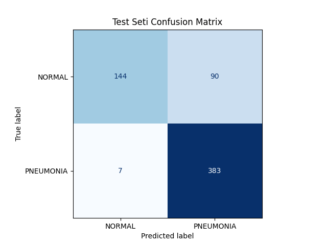

# Chest X-Ray Pneumonia Detection (DenseNet121)

This project uses Transfer Learning with DenseNet121 to detect pneumonia from chest X-ray images.

## Features
- Transfer Learning (ImageNet pretrained)
- Data augmentation
- Early stopping & LR scheduling
- Confusion matrix evaluation

## Results
Validation Accuracy: **96%**

## Confusion Matrix


## Run

```bash
pip install -r requirements.txt
python src/train.py


